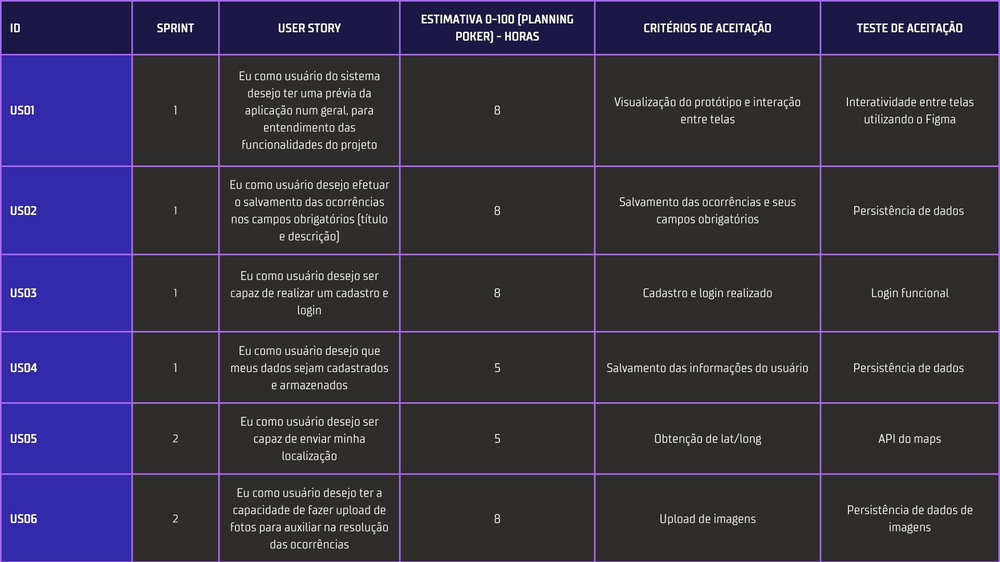
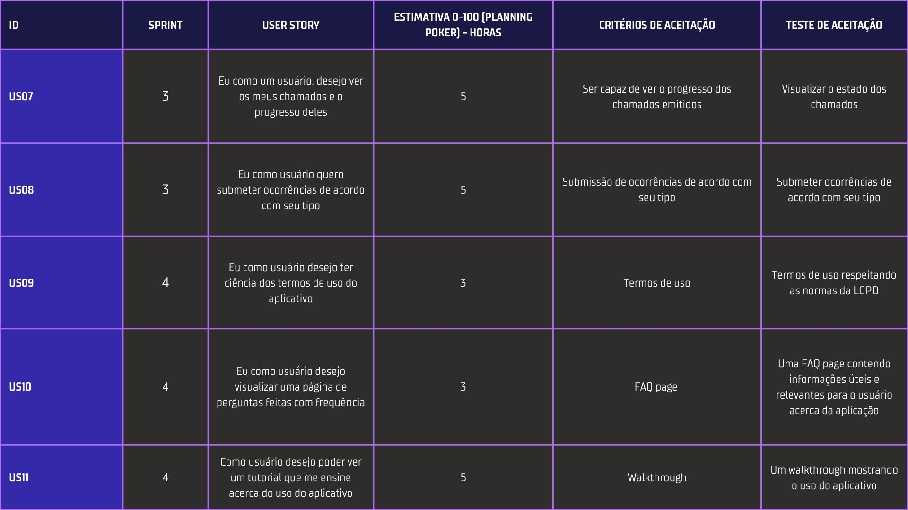
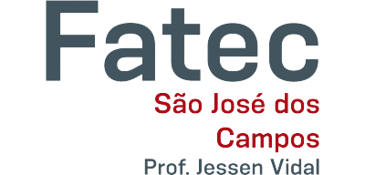
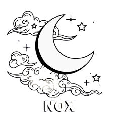

# Aprendizado por Projeto Integrador

# Sumário  
- [Introdução](#introducao)
- - [Disciplinas Integradas ao Projeto](#disciplinas)
- - [Objetivo](#objetivo)
- - [Desafio](#desafio)
- - [Informativo](#informativo)
- [Documentação](#documentacao)
- - [Product Backlog](#backlog)
- - [Sprint Backlog](#sprintBacklog)
- [Cronograma](#cronograma)
- [Tecnologias](#tecnologias)
- [Integrantes da Equipe](#integrantes)
# Introdução 

Projeto desenvolvido por alunos do quinto semestre do curso de `Análise e Desenvolvimento de Sistemas` da <a href="https://fatecsjc-prd.azurewebsites.net/">Fatec Prof. Jessen Vidal</a>, em São José dos Campos - SP, durante o segundo semestre do ano de 2022.
## 🎓 Disciplinas Integradas ao Projeto 
- Programação para Dispositivos Móveis;
- Laboratório de Banco de Dados;
- Redes de Computadores;
- Segurança da Informação.

## 🎯 Objetivo 
 A criação de uma aplicação mobile para coleta de dados públicos, de acordo com o conceito *citizens sensors*, para auxilio da secretaria de obras e serviço público.

## ⏱️ Desafio 

- Utilizar a função dentro do APP para tirar a fotografia;
- Utlizar o Georreferenciamento da foto;
- Fazer o armazenamento da foto direto no Back-end da aplicação;
- A Modelagem de banco de dados para armazenamento de grande volume de dados.

## 🏷️ Informativo 

Município: É uma unidade administrativa que possui uma sede, que normalmente é a cidade, e uma estrutura  de  poder  público  para  atender  suas  necessidades  específicas.  Cada  município  tem  um prefeito.  Em  geral,  o  poder  público  municipal  é  dividido  em  secretarias,  estrutura  pensada  para melhor organizar as principais demandas de cada município.

Secretária: A secretaria de obras e serviços públicos (SOSP) tem por responsabilidade atender a prefeitura, à assistir a população em tudo que se refere a obras e serviços públicos, com atuação físico territorial, atentando aos aspectos sociais e de bem estar, econômicos, administrativos epolíticos.

Coleta de dados públicos: São importantes e fundamentais, para o trabalho da SOSP não é uma tarefa fácil ou barata. Uma solução para este  problema é  aplicar o conceito de  citizens as sensors. Cidadãos como sensores (citizens as sensors) é um conceito, que sugere utilizar a população local de pessoas como fonte de informação à distância (citizens database). Portanto, o objetivo do projeto é entregar ao cidadão alguma ferramenta (aplicativo), onde ele possa inserir informações, que irão auxiliar na gestão pública do seu munícipio, em apoio a SOSP.

# 📂 Documentação 

- ## PRODUCT BACKLOG 

- ## Sprint Backlog 

    

- ## <a src="/mobile">Instalação do Projeto Mobile</a> 

 

# 📅 Cronograma de Entregas 

> Datas definidas sobre as entregas das sprints.

- [x] [SPRINT 1 - 29/08/2022 a 18/09/2022; - ](Refer%C3%AAncias/Documenta%C3%A7%C3%A3o/Sprint%201/)

- [x] [SPRINT 2 - 19/09/2022 a 09/10/2022; - ](Refer%C3%AAncias/Documenta%C3%A7%C3%A3o/Sprint%202/)
- [x] [SPRINT 3 - 13/10/2022 a 06/11/2022; - ](Refer%C3%AAncias/Documenta%C3%A7%C3%A3o/Sprint%203/)
- [X] [SPRINT 4 - 07/11/2022 a 27/11/2022. - ](Refer%C3%AAncias/Documenta%C3%A7%C3%A3o/Sprint%2034/)

Feira de Soluções & Apresentação Final - 05/12/2022
# 💻 Tecnologias 

- 

    Utilizado pela versatilidade e praticidade no desenvolvimento híbrido para aplicações mobile.

- 

    Tecnologia principal do desenvolvimento, utilizada para a estruturação do servidor/Back-end (NodeJS) e as funcionalidades do Front-end (React Native).

- 

    Utilizado para o Back-end da aplicação, onde o Node tem por foco no desenvolvimento próximo ao servidor.

- 

    Banco de Dados não relacional, utilizado para armazenar os dados da aplicação em JSON.

## ✒️ Wireframe

- 

    Utilizado para prototipagem da aplicação mobile.
# 👩‍💻 Integrantes da Equipe 👨‍💻 

[  Sarah Santana  <a href="https://www.linkedin.com/in/sarah-santana-843394200">Scrum Master</a>  ](https://github.com/Sarah781)   | [  André Silva  <a href="https://www.linkedin.com/in/andr%C3%A9-da-silva-e-silva-63a4621ba/">Product Owner</a>  ](https://github.com/AndreSilva358)   | [  Jonathan Gabriel <a href="https://www.linkedin.com/in/jonathan-gabriel-">Dev Team</a>  ](https://github.com/Jonathan-Assis)   | [  Leonardo Ribeiro  <a href="https://www.linkedin.com/in/leonardo-gustavo-ribeiro-ba23831b6">Dev Team</a> ](https://github.com/Leo0256)   |
| :---: | :---: | :---: | :---: | 
[  Matheus Emboaba  <a href="https://www.linkedin.com/in/matheus-emboaba-a21970236">Dev Team</a> ](https://github.com/MatheusEmboabaTeteu)   | [  Raul Iglesias  <a href="https://linkedin.com/in/raul-iglesias-8010201a1">Dev Team</a> ](https://github.com/RaulIglesias)   | [  Rita Ferreira  <a href="https://www.linkedin.com/in/rita-ferreira-894ba1200">Dev Team</a> ](https://github.com/ferreirarita)   |

 

<!-- #  Versão APK do Ocorrências Públicas
Escaneie o QR Code abaixo para efetuar o download do APK

    
    

 -->

 

[⬆ Voltar ao topo](#topo)

    
    

