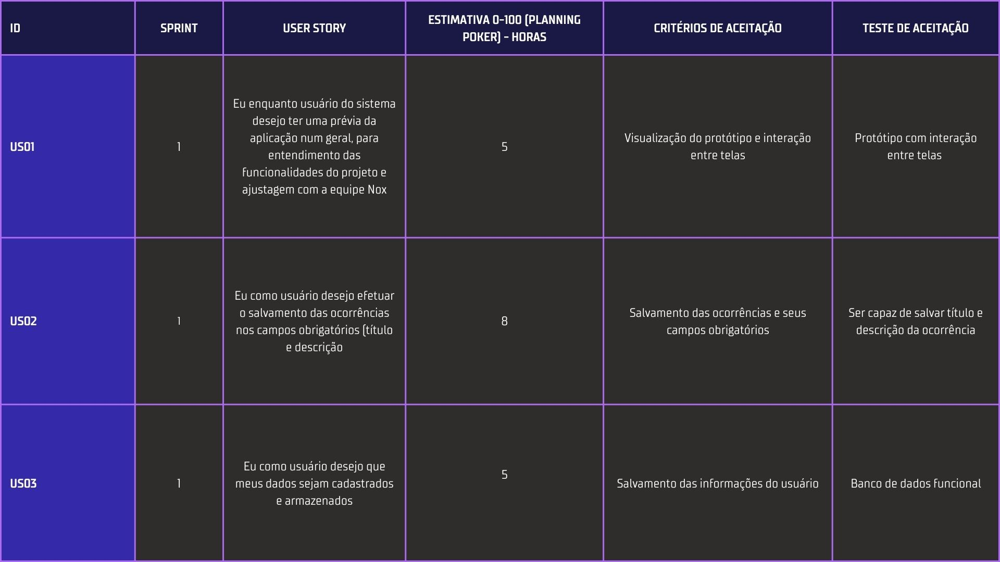
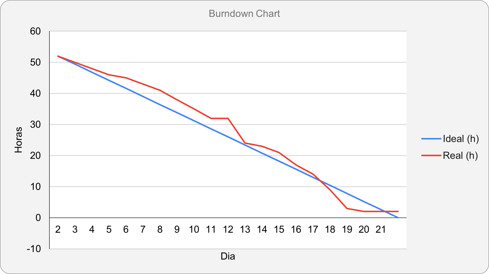
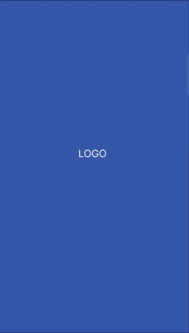
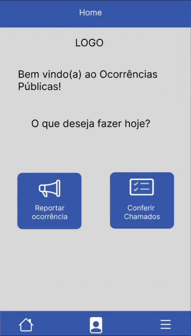
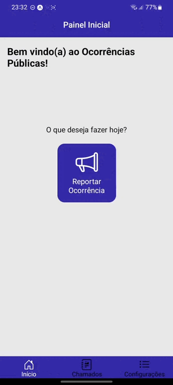

# Sprint 1

Entrega do dia 18/09/2022, tendo como base nos requerimentos da entrega:

- ## 📋 Sprint Backlog

A imagem abaixo descreve as Users Story do usuário entregues nesta sprint.

- ## 📊 Gráfico Burndown

O gráfico abaixo representa o desempenho da equipe com base no período de 29/08/2022 à 18/09/2022 na realização das tarefas atribuídas para a entrega.

- ## ✒️ Wireframe

<a href="https://www.figma.com/proto/jWVZKzzxK3lfpdcwSv3jQA/5-Semestre-team-library?node-id=431%3A2&scaling=scale-down&starting-point-node-id=411%3A2&show-proto-sidebar=1">Link do Play do protótipo Figma</a>

Os gifs abaixo é o protótipo das telas realizadas para a entrega da sprint.

    
    

- ## 📱 App

Os gifs abaixo representam o aplicativo atual da entrega da sprint.

    
    

- ## 📱 Versão do Projeto

