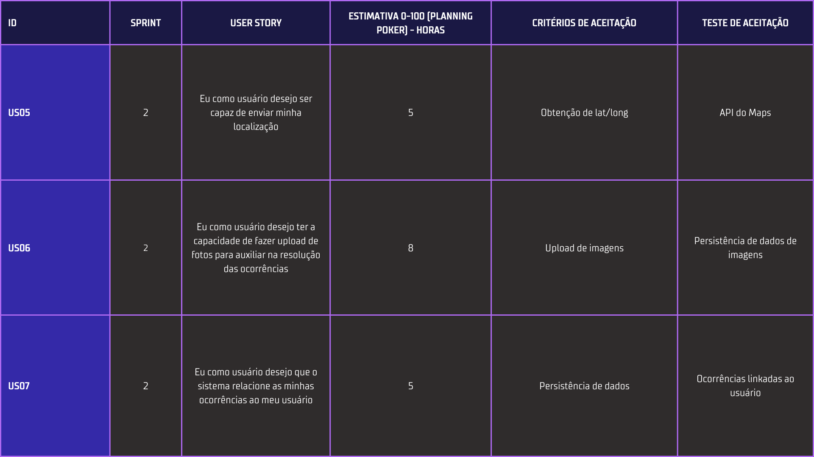
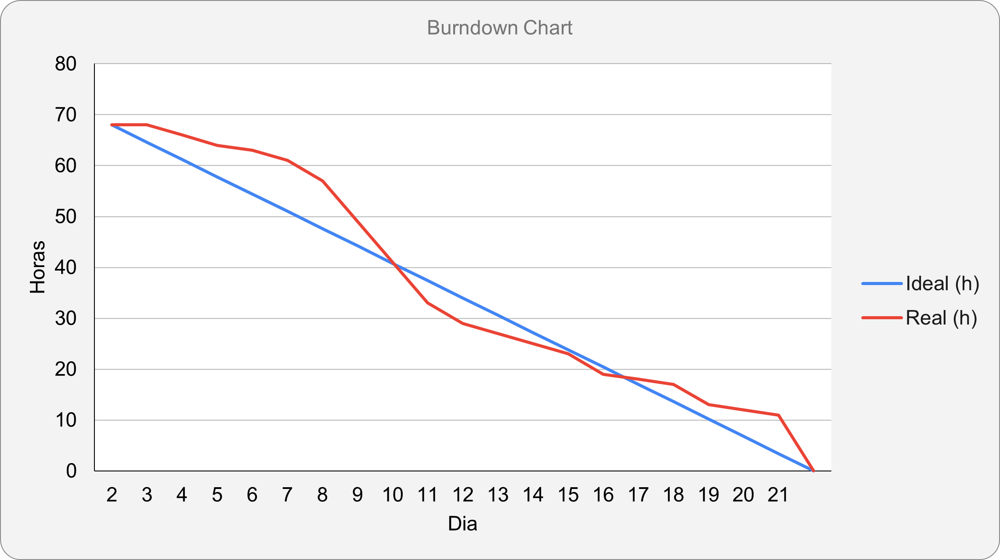
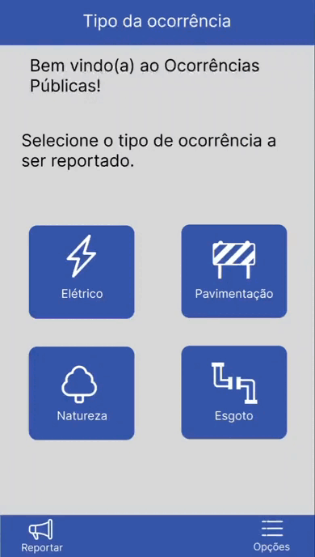
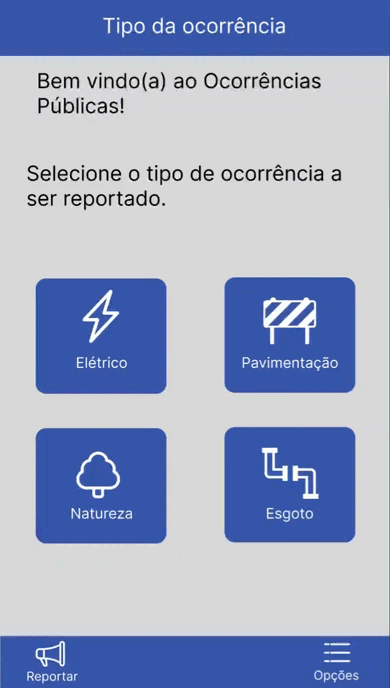
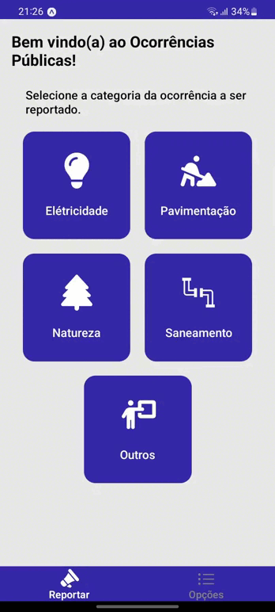

# Sprint 2

Entrega do dia 09/10/2022, tendo como base nos requerimentos da entrega:

- ## 📋 Sprint Backlog

A imagem abaixo descreve as Users Story do usuário entregues nesta sprint.

- ## 📊 Gráfico Burndown

O gráfico abaixo representa o desempenho da equipe com base no período de 19/09/2022 a 09/10/2022 na realização das tarefas atribuídas para a entrega.

- ## ✒️ Wireframe

Os gifs abaixo representam um comparativo do protótipo das telas realizadas no Figma a esquerda e o aplicativo real em execução a direita.

### 📲 Tela de Login e Cadastro
Está tela é dedicada ao acesso e criação da conta do usuário.

    
    
    

 

### 📢 Tela de Reportar Ocorrência
A tela de reportar ocorrência tem por objetivo relatar o problema encontrado em sua cidade, selecionando a categoria principal e o preenchimento do formulário da ocorrência, como principal motivo, título do problema relatado, local onde ocorreu utilizando o mapa e uma descrição sobre o problema.

    
    
    

 

### ✍🏻 Tela de Editar Perfil
A tela de editar perfil tem por objetivo o usuário alterar as informações cadastrais e a exclusão de sua conta.

    
    
    

- ## 📱 App

