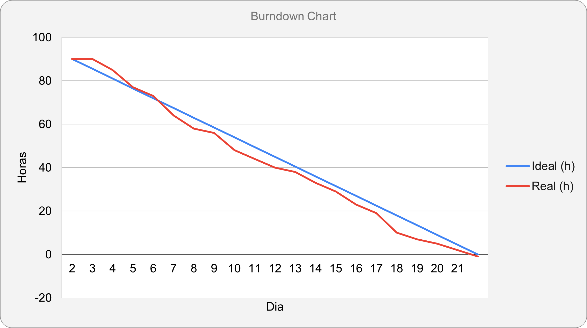
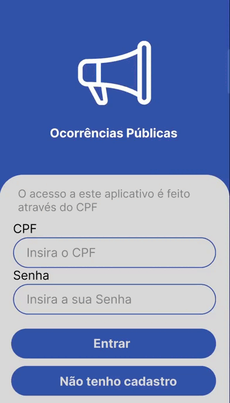

# Sprint 3

Entrega do dia 06/11/2022, tendo como base nos requerimentos da entrega:

- ## 📋 Sprint Backlog

A imagem abaixo descreve as Users Story do usuário entregues nesta sprint.

- ## 📊 Gráfico Burndown

O gráfico abaixo representa o desempenho da equipe com base no período de 13/10/2022 a 06/11/2022 na realização das tarefas atribuídas para a entrega.

- ## ✒️ Wireframe

Os gifs abaixo representam um comparativo do protótipo das telas realizadas no Figma a esquerda e o aplicativo real em execução a direita.

### 🗺️ Tela de Chamados
A tela de Chamados tem por objetivo mostrar ao cidadão suas ocorrências reportadas e todas as ocorrências de sua região, sendo possível filtrar pelo tipo da ocorrência nos menus superiores e visualizar na lista do Bottom sheet.

    
    
    

 

- ## 📱 Versão do Projeto

